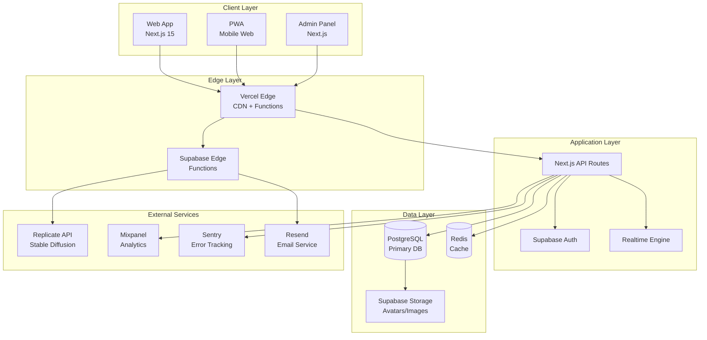

# Points Forest - Technical Architecture

## 🏗️ System Architecture Overview



## 🔧 Technology Stack

### Frontend Architecture

#### Core Framework
```typescript
// Next.js 15 App Router Configuration
// next.config.js
/** @type {import('next').NextConfig} */
const nextConfig = {
  experimental: {
    typedRoutes: true,
    serverComponentsExternalPackages: ['@supabase/supabase-js']
  },
  images: {
    domains: ['avatar.vercel.sh', 'supabase.co'],
    formats: ['image/avif', 'image/webp']
  },
  env: {
    NEXT_PUBLIC_SUPABASE_URL: process.env.NEXT_PUBLIC_SUPABASE_URL,
    NEXT_PUBLIC_SUPABASE_ANON_KEY: process.env.NEXT_PUBLIC_SUPABASE_ANON_KEY,
  }
}

module.exports = nextConfig
```

#### State Management Architecture
```typescript
// stores/gameStore.ts - Zustand Store
interface GameState {
  currentGame: Game | null;
  gameHistory: GameSession[];
  dailyLimits: Record<string, number>;
  isPlaying: boolean;
}

interface GameActions {
  startGame: (gameId: string) => void;
  endGame: (result: GameResult) => Promise<void>;
  fetchGameHistory: () => Promise<void>;
  checkDailyLimits: () => Promise<void>;
}

export const useGameStore = create<GameState & GameActions>((set, get) => ({
  // State
  currentGame: null,
  gameHistory: [],
  dailyLimits: {},
  isPlaying: false,
  
  // Actions
  startGame: (gameId) => {
    set({ isPlaying: true });
    // Implementation
  },
  
  endGame: async (result) => {
    const { currentGame } = get();
    if (!currentGame) return;
    
    try {
      await gameAPI.submitScore(currentGame.id, result);
      set({ isPlaying: false, currentGame: null });
    } catch (error) {
      console.error('Failed to submit game result:', error);
    }
  }
}));
```

#### Component Architecture
```typescript
// components/ui/ - Shadcn/ui Base Components
// components/features/ - Feature-specific Components
// components/layouts/ - Layout Components

// Example: Game Component Structure
interface GameComponentProps {
  gameConfig: GameConfig;
  onGameEnd: (result: GameResult) => void;
  isDisabled?: boolean;
}

// components/features/games/NumberGuessingGame.tsx
export const NumberGuessingGame: React.FC<GameComponentProps> = ({
  gameConfig,
  onGameEnd,
  isDisabled = false
}) => {
  const [guess, setGuess] = useState<number>(50);
  const [targetNumber] = useState(() => 
    Math.floor(Math.random() * 100) + 1
  );
  
  const handleSubmit = useCallback(() => {
    const score = 100 - Math.abs(guess - targetNumber);
    const pointsEarned = Math.max(score, 1);
    
    onGameEnd({
      score,
      pointsEarned,
      metadata: { guess, targetNumber, accuracy: score }
    });
  }, [guess, targetNumber, onGameEnd]);
  
  return (
    <Card className="p-6">
      <CardHeader>
        <CardTitle>数字当てゲーム</CardTitle>
        <CardDescription>1から100の数字を予想してください</CardDescription>
      </CardHeader>
      <CardContent>
        <div className="space-y-4">
          <div className="text-center">
            <Label htmlFor="guess">あなたの予想</Label>
            <Input
              id="guess"
              type="number"
              min="1"
              max="100"
              value={guess}
              onChange={(e) => setGuess(Number(e.target.value))}
              disabled={isDisabled}
            />
          </div>
          <Button 
            onClick={handleSubmit} 
            disabled={isDisabled}
            className="w-full"
          >
            予想を送信
          </Button>
        </div>
      </CardContent>
    </Card>
  );
};
```

### Backend Architecture

#### Supabase Configuration
```sql
-- Database Schema with RLS Policies

-- Enable RLS on all tables
ALTER TABLE users ENABLE ROW LEVEL SECURITY;
ALTER TABLE point_transactions ENABLE ROW LEVEL SECURITY;
ALTER TABLE game_sessions ENABLE ROW LEVEL SECURITY;
ALTER TABLE user_achievements ENABLE ROW LEVEL SECURITY;

-- RLS Policies
CREATE POLICY "Users can view own profile" ON users
  FOR SELECT USING (auth.uid() = id);

CREATE POLICY "Users can update own profile" ON users
  FOR UPDATE USING (auth.uid() = id);

CREATE POLICY "Users can view own transactions" ON point_transactions
  FOR SELECT USING (auth.uid() = user_id);

CREATE POLICY "Users can view own game sessions" ON game_sessions
  FOR SELECT USING (auth.uid() = user_id);

-- Functions for game logic
CREATE OR REPLACE FUNCTION handle_game_session(
  p_user_id UUID,
  p_game_id UUID,
  p_score INTEGER,
  p_points_earned INTEGER,
  p_metadata JSONB DEFAULT '{}'
)
RETURNS JSONB
LANGUAGE plpgsql
SECURITY DEFINER
AS $$
DECLARE
  v_daily_count INTEGER;
  v_game_limit INTEGER;
  v_session_id UUID;
  v_transaction_id UUID;
BEGIN
  -- Check daily limit
  SELECT count(*) INTO v_daily_count
  FROM game_sessions gs
  JOIN games g ON g.id = gs.game_id
  WHERE gs.user_id = p_user_id 
    AND gs.game_id = p_game_id
    AND gs.created_at::date = CURRENT_DATE;
  
  SELECT daily_limit INTO v_game_limit
  FROM games 
  WHERE id = p_game_id;
  
  IF v_daily_count >= v_game_limit THEN
    RETURN jsonb_build_object(
      'success', false,
      'error', 'Daily limit exceeded'
    );
  END IF;
  
  -- Create game session
  INSERT INTO game_sessions (user_id, game_id, score, points_earned, metadata)
  VALUES (p_user_id, p_game_id, p_score, p_points_earned, p_metadata)
  RETURNING id INTO v_session_id;
  
  -- Add points to user
  UPDATE users 
  SET points = points + p_points_earned,
      experience = experience + p_points_earned
  WHERE id = p_user_id;
  
  -- Record point transaction
  INSERT INTO point_transactions (user_id, amount, type, source, metadata)
  VALUES (p_user_id, p_points_earned, 'earn', 'game', 
    jsonb_build_object('game_id', p_game_id, 'session_id', v_session_id))
  RETURNING id INTO v_transaction_id;
  
  -- Check for achievements
  PERFORM check_achievements(p_user_id);
  
  RETURN jsonb_build_object(
    'success', true,
    'session_id', v_session_id,
    'transaction_id', v_transaction_id,
    'points_earned', p_points_earned
  );
END;
$$;
```

#### API Route Structure
```typescript
// app/api/games/[gameId]/play/route.ts
import { createRouteHandlerClient } from '@supabase/auth-helpers-nextjs';
import { NextRequest, NextResponse } from 'next/server';
import { z } from 'zod';

const PlayGameSchema = z.object({
  gameData: z.record(z.any()),
  score: z.number().min(0).max(1000),
});

export async function POST(
  request: NextRequest,
  { params }: { params: { gameId: string } }
) {
  try {
    const supabase = createRouteHandlerClient({ cookies });
    
    // Authenticate user
    const { data: { user }, error: authError } = await supabase.auth.getUser();
    if (authError || !user) {
      return NextResponse.json({ error: 'Unauthorized' }, { status: 401 });
    }
    
    // Validate input
    const body = await request.json();
    const { gameData, score } = PlayGameSchema.parse(body);
    
    // Calculate points based on game type and score
    const pointsEarned = calculateGamePoints(params.gameId, score, gameData);
    
    // Call database function
    const { data, error } = await supabase.rpc('handle_game_session', {
      p_user_id: user.id,
      p_game_id: params.gameId,
      p_score: score,
      p_points_earned: pointsEarned,
      p_metadata: gameData
    });
    
    if (error) {
      console.error('Game session error:', error);
      return NextResponse.json(
        { error: 'Failed to process game session' }, 
        { status: 500 }
      );
    }
    
    if (!data.success) {
      return NextResponse.json(
        { error: data.error }, 
        { status: 400 }
      );
    }
    
    return NextResponse.json({
      sessionId: data.session_id,
      pointsEarned: data.points_earned,
      score
    });
    
  } catch (error) {
    console.error('API Error:', error);
    return NextResponse.json(
      { error: 'Internal server error' }, 
      { status: 500 }
    );
  }
}

function calculateGamePoints(gameId: string, score: number, gameData: any): number {
  switch (gameId) {
    case 'number-guess':
      return Math.max(score, 1); // Score is already calculated as 100 - |guess - target|
    
    case 'roulette':
      const segment = gameData.landedSegment;
      const pointsMap = { 0: 5, 1: 10, 2: 25, 3: 50, 4: 100, 5: 200, 6: 500, 7: 1000 };
      return pointsMap[segment] || 5;
    
    case 'memory-cards':
      const timeBonus = Math.max(0, 300 - gameData.timeSeconds); // Bonus for speed
      const attemptPenalty = Math.max(0, gameData.attempts - gameData.pairs) * 5;
      return Math.max(50 + timeBonus - attemptPenalty, 10);
    
    default:
      return 10; // Default points
  }
}
```

### Database Architecture

#### Core Tables Design
```sql
-- Enhanced user table with gaming features
CREATE TABLE users (
  id UUID PRIMARY KEY DEFAULT gen_random_uuid(),
  email TEXT UNIQUE NOT NULL,
  username TEXT UNIQUE NOT NULL,
  display_name TEXT,
  
  -- Game progression
  points INTEGER DEFAULT 0 CHECK (points >= 0),
  level INTEGER DEFAULT 1 CHECK (level >= 1),
  experience INTEGER DEFAULT 0 CHECK (experience >= 0),
  
  -- Engagement tracking
  login_streak INTEGER DEFAULT 0,
  last_login_at TIMESTAMPTZ,
  last_daily_bonus_at TIMESTAMPTZ,
  
  -- Profile customization
  avatar_url TEXT,
  avatar_config JSONB DEFAULT '{}',
  profile_theme TEXT DEFAULT 'default',
  
  -- Account status
  is_premium BOOLEAN DEFAULT FALSE,
  premium_expires_at TIMESTAMPTZ,
  is_banned BOOLEAN DEFAULT FALSE,
  ban_reason TEXT,
  
  -- Metadata
  signup_ip INET,
  last_seen_at TIMESTAMPTZ DEFAULT NOW(),
  created_at TIMESTAMPTZ DEFAULT NOW(),
  updated_at TIMESTAMPTZ DEFAULT NOW()
);

-- Optimized indexes for performance
CREATE INDEX idx_users_points ON users(points DESC);
CREATE INDEX idx_users_level ON users(level DESC);
CREATE INDEX idx_users_login_streak ON users(login_streak DESC);
CREATE INDEX idx_users_last_login ON users(last_login_at);
CREATE INDEX idx_users_premium ON users(is_premium, premium_expires_at);

-- Games configuration table
CREATE TABLE games (
  id UUID PRIMARY KEY DEFAULT gen_random_uuid(),
  name TEXT NOT NULL,
  slug TEXT UNIQUE NOT NULL, -- URL-friendly identifier
  type TEXT NOT NULL CHECK (type IN ('number_guess', 'roulette', 'memory', 'trivia')),
  
  -- Game configuration
  config JSONB NOT NULL DEFAULT '{}',
  daily_limit INTEGER DEFAULT 10 CHECK (daily_limit > 0),
  min_points INTEGER DEFAULT 1,
  max_points INTEGER DEFAULT 1000,
  
  -- Game state
  is_active BOOLEAN DEFAULT TRUE,
  is_beta BOOLEAN DEFAULT FALSE,
  requires_premium BOOLEAN DEFAULT FALSE,
  
  -- Metadata
  description TEXT,
  instructions TEXT,
  icon_url TEXT,
  thumbnail_url TEXT,
  
  created_at TIMESTAMPTZ DEFAULT NOW(),
  updated_at TIMESTAMPTZ DEFAULT NOW()
);

-- Point transactions with enhanced tracking
CREATE TABLE point_transactions (
  id UUID PRIMARY KEY DEFAULT gen_random_uuid(),
  user_id UUID REFERENCES users(id) ON DELETE CASCADE,
  
  -- Transaction details
  amount INTEGER NOT NULL, -- Can be negative for spending
  balance_after INTEGER NOT NULL CHECK (balance_after >= 0),
  type TEXT NOT NULL CHECK (type IN ('earn', 'spend', 'bonus', 'refund', 'admin')),
  source TEXT NOT NULL, -- 'game', 'achievement', 'daily_bonus', 'purchase', etc.
  
  -- Context
  description TEXT,
  metadata JSONB DEFAULT '{}',
  reference_id UUID, -- Links to game_sessions, purchases, etc.
  
  -- Admin tracking
  admin_id UUID REFERENCES users(id), -- If admin action
  admin_note TEXT,
  
  created_at TIMESTAMPTZ DEFAULT NOW()
);

-- Indexes for transaction queries
CREATE INDEX idx_point_transactions_user ON point_transactions(user_id, created_at DESC);
CREATE INDEX idx_point_transactions_type ON point_transactions(type, created_at DESC);
CREATE INDEX idx_point_transactions_source ON point_transactions(source, created_at DESC);
CREATE INDEX idx_point_transactions_reference ON point_transactions(reference_id);

-- Game sessions with detailed tracking
CREATE TABLE game_sessions (
  id UUID PRIMARY KEY DEFAULT gen_random_uuid(),
  user_id UUID REFERENCES users(id) ON DELETE CASCADE,
  game_id UUID REFERENCES games(id) ON DELETE CASCADE,
  
  -- Game results
  score INTEGER,
  points_earned INTEGER DEFAULT 0,
  duration_seconds INTEGER,
  
  -- Game state
  game_data JSONB DEFAULT '{}', -- Game-specific data
  metadata JSONB DEFAULT '{}',  -- Additional context
  
  -- Session tracking
  session_id TEXT, -- Browser session ID
  ip_address INET,
  user_agent TEXT,
  
  created_at TIMESTAMPTZ DEFAULT NOW()
);

-- Indexes for game session queries
CREATE INDEX idx_game_sessions_user ON game_sessions(user_id, created_at DESC);
CREATE INDEX idx_game_sessions_game ON game_sessions(game_id, created_at DESC);
CREATE INDEX idx_game_sessions_daily ON game_sessions(user_id, game_id, (created_at::date));
CREATE INDEX idx_game_sessions_score ON game_sessions(game_id, score DESC);

-- Achievements system
CREATE TABLE achievements (
  id UUID PRIMARY KEY DEFAULT gen_random_uuid(),
  name TEXT NOT NULL,
  slug TEXT UNIQUE NOT NULL,
  description TEXT,
  
  -- Categorization
  category TEXT NOT NULL CHECK (category IN ('login', 'games', 'points', 'social', 'special')),
  rarity TEXT NOT NULL CHECK (rarity IN ('common', 'rare', 'epic', 'legendary')),
  
  -- Reward
  point_reward INTEGER DEFAULT 0,
  badge_image_url TEXT,
  
  -- Achievement logic
  conditions JSONB NOT NULL, -- Achievement requirements
  is_secret BOOLEAN DEFAULT FALSE,
  is_repeatable BOOLEAN DEFAULT FALSE,
  
  -- Status
  is_active BOOLEAN DEFAULT TRUE,
  sort_order INTEGER DEFAULT 0,
  
  created_at TIMESTAMPTZ DEFAULT NOW(),
  updated_at TIMESTAMPTZ DEFAULT NOW()
);

-- User achievement progress
CREATE TABLE user_achievements (
  id UUID PRIMARY KEY DEFAULT gen_random_uuid(),
  user_id UUID REFERENCES users(id) ON DELETE CASCADE,
  achievement_id UUID REFERENCES achievements(id) ON DELETE CASCADE,
  
  -- Progress tracking
  progress JSONB DEFAULT '{}',
  current_value INTEGER DEFAULT 0,
  target_value INTEGER,
  
  -- Completion
  completed_at TIMESTAMPTZ,
  notified_at TIMESTAMPTZ,
  
  created_at TIMESTAMPTZ DEFAULT NOW(),
  updated_at TIMESTAMPTZ DEFAULT NOW(),
  
  UNIQUE(user_id, achievement_id)
);

-- Leaderboards for rankings
CREATE TABLE leaderboards (
  id UUID PRIMARY KEY DEFAULT gen_random_uuid(),
  name TEXT NOT NULL,
  type TEXT NOT NULL CHECK (type IN ('points', 'level', 'game_score', 'streak')),
  
  -- Leaderboard configuration
  game_id UUID REFERENCES games(id), -- For game-specific leaderboards
  period TEXT DEFAULT 'all_time' CHECK (period IN ('all_time', 'monthly', 'weekly', 'daily')),
  
  -- Settings
  max_entries INTEGER DEFAULT 100,
  is_active BOOLEAN DEFAULT TRUE,
  
  created_at TIMESTAMPTZ DEFAULT NOW()
);

-- Leaderboard entries (materialized for performance)
CREATE TABLE leaderboard_entries (
  id UUID PRIMARY KEY DEFAULT gen_random_uuid(),
  leaderboard_id UUID REFERENCES leaderboards(id) ON DELETE CASCADE,
  user_id UUID REFERENCES users(id) ON DELETE CASCADE,
  
  -- Ranking data
  rank INTEGER NOT NULL,
  value INTEGER NOT NULL, -- Points, score, streak, etc.
  
  -- Metadata
  metadata JSONB DEFAULT '{}',
  
  -- Time period
  period_start TIMESTAMPTZ,
  period_end TIMESTAMPTZ,
  
  updated_at TIMESTAMPTZ DEFAULT NOW(),
  
  UNIQUE(leaderboard_id, user_id, period_start)
);
```

#### Advanced Database Functions
```sql
-- Achievement checking system
CREATE OR REPLACE FUNCTION check_achievements(p_user_id UUID)
RETURNS INTEGER
LANGUAGE plpgsql
SECURITY DEFINER
AS $$
DECLARE
  achievement_record RECORD;
  user_record RECORD;
  progress_record RECORD;
  new_achievements INTEGER := 0;
BEGIN
  -- Get user data
  SELECT * INTO user_record FROM users WHERE id = p_user_id;
  
  -- Loop through all active achievements
  FOR achievement_record IN 
    SELECT * FROM achievements WHERE is_active = TRUE
  LOOP
    -- Get current progress
    SELECT * INTO progress_record 
    FROM user_achievements 
    WHERE user_id = p_user_id AND achievement_id = achievement_record.id;
    
    -- Check if achievement is already completed (and not repeatable)
    IF progress_record.completed_at IS NOT NULL AND NOT achievement_record.is_repeatable THEN
      CONTINUE;
    END IF;
    
    -- Check achievement conditions based on category
    CASE achievement_record.category
      WHEN 'login' THEN
        IF check_login_achievement(achievement_record, user_record, progress_record) THEN
          PERFORM complete_achievement(p_user_id, achievement_record.id);
          new_achievements := new_achievements + 1;
        END IF;
        
      WHEN 'games' THEN
        IF check_game_achievement(achievement_record, user_record, progress_record) THEN
          PERFORM complete_achievement(p_user_id, achievement_record.id);
          new_achievements := new_achievements + 1;
        END IF;
        
      WHEN 'points' THEN
        IF check_points_achievement(achievement_record, user_record, progress_record) THEN
          PERFORM complete_achievement(p_user_id, achievement_record.id);
          new_achievements := new_achievements + 1;
        END IF;
    END CASE;
  END LOOP;
  
  RETURN new_achievements;
END;
$$;

-- Leaderboard update function
CREATE OR REPLACE FUNCTION update_leaderboards()
RETURNS VOID
LANGUAGE plpgsql
SECURITY DEFINER
AS $$
BEGIN
  -- Update all-time points leaderboard
  INSERT INTO leaderboard_entries (leaderboard_id, user_id, rank, value, updated_at)
  SELECT 
    (SELECT id FROM leaderboards WHERE type = 'points' AND period = 'all_time'),
    u.id,
    ROW_NUMBER() OVER (ORDER BY u.points DESC),
    u.points,
    NOW()
  FROM users u
  WHERE u.points > 0
  ON CONFLICT (leaderboard_id, user_id, period_start) 
  DO UPDATE SET 
    rank = EXCLUDED.rank,
    value = EXCLUDED.value,
    updated_at = EXCLUDED.updated_at;
    
  -- Update weekly points leaderboard
  INSERT INTO leaderboard_entries (leaderboard_id, user_id, rank, value, period_start, period_end, updated_at)
  SELECT 
    (SELECT id FROM leaderboards WHERE type = 'points' AND period = 'weekly'),
    pt.user_id,
    ROW_NUMBER() OVER (ORDER BY SUM(pt.amount) DESC),
    SUM(pt.amount),
    date_trunc('week', NOW()),
    date_trunc('week', NOW()) + interval '1 week',
    NOW()
  FROM point_transactions pt
  WHERE pt.created_at >= date_trunc('week', NOW())
    AND pt.amount > 0
  GROUP BY pt.user_id
  HAVING SUM(pt.amount) > 0
  ON CONFLICT (leaderboard_id, user_id, period_start) 
  DO UPDATE SET 
    rank = EXCLUDED.rank,
    value = EXCLUDED.value,
    updated_at = EXCLUDED.updated_at;
END;
$$;
```

### Caching Strategy

#### Redis Configuration
```typescript
// lib/redis.ts
import { Redis } from '@upstash/redis';

export const redis = new Redis({
  url: process.env.UPSTASH_REDIS_REST_URL!,
  token: process.env.UPSTASH_REDIS_REST_TOKEN!,
});

// Cache keys
export const CACHE_KEYS = {
  USER_PROFILE: (userId: string) => `user:${userId}:profile`,
  GAME_CONFIG: (gameId: string) => `game:${gameId}:config`,
  LEADERBOARD: (type: string, period: string) => `leaderboard:${type}:${period}`,
  DAILY_LIMITS: (userId: string, date: string) => `limits:${userId}:${date}`,
  ACHIEVEMENTS: (userId: string) => `achievements:${userId}`,
} as const;

// Cache utilities
export class CacheManager {
  private static readonly DEFAULT_TTL = 3600; // 1 hour
  
  static async get<T>(key: string): Promise<T | null> {
    try {
      const data = await redis.get(key);
      return data as T;
    } catch (error) {
      console.error('Cache get error:', error);
      return null;
    }
  }
  
  static async set(key: string, value: any, ttl = this.DEFAULT_TTL): Promise<void> {
    try {
      await redis.setex(key, ttl, JSON.stringify(value));
    } catch (error) {
      console.error('Cache set error:', error);
    }
  }
  
  static async del(key: string): Promise<void> {
    try {
      await redis.del(key);
    } catch (error) {
      console.error('Cache delete error:', error);
    }
  }
  
  static async invalidatePattern(pattern: string): Promise<void> {
    try {
      const keys = await redis.keys(pattern);
      if (keys.length > 0) {
        await redis.del(...keys);
      }
    } catch (error) {
      console.error('Cache pattern invalidation error:', error);
    }
  }
}
```

### Real-time Architecture

#### Supabase Realtime Configuration
```typescript
// lib/realtime.ts
import { createClient } from '@supabase/supabase-js';

const supabase = createClient(
  process.env.NEXT_PUBLIC_SUPABASE_URL!,
  process.env.NEXT_PUBLIC_SUPABASE_ANON_KEY!,
  {
    realtime: {
      params: {
        eventsPerSecond: 10
      }
    }
  }
);

// Real-time subscriptions for live features
export class RealtimeManager {
  private static subscriptions = new Map<string, any>();
  
  static subscribeToUserPoints(userId: string, callback: (points: number) => void) {
    const channel = supabase
      .channel(`user-points-${userId}`)
      .on(
        'postgres_changes',
        {
          event: 'UPDATE',
          schema: 'public',
          table: 'users',
          filter: `id=eq.${userId}`
        },
        (payload) => {
          callback(payload.new.points);
        }
      )
      .subscribe();
      
    this.subscriptions.set(`user-points-${userId}`, channel);
    return channel;
  }
  
  static subscribeToLeaderboard(type: string, callback: (entries: any[]) => void) {
    const channel = supabase
      .channel(`leaderboard-${type}`)
      .on(
        'postgres_changes',
        {
          event: '*',
          schema: 'public',
          table: 'leaderboard_entries'
        },
        async () => {
          // Fetch updated leaderboard data
          const { data } = await supabase
            .from('leaderboard_entries')
            .select(`
              *,
              users(username, display_name, avatar_url)
            `)
            .order('rank');
            
          callback(data || []);
        }
      )
      .subscribe();
      
    this.subscriptions.set(`leaderboard-${type}`, channel);
    return channel;
  }
  
  static unsubscribe(key: string) {
    const subscription = this.subscriptions.get(key);
    if (subscription) {
      supabase.removeChannel(subscription);
      this.subscriptions.delete(key);
    }
  }
  
  static unsubscribeAll() {
    this.subscriptions.forEach((subscription, key) => {
      supabase.removeChannel(subscription);
    });
    this.subscriptions.clear();
  }
}
```

## 🔐 Security Architecture

### Authentication & Authorization
```typescript
// middleware.ts - Next.js Middleware for Route Protection
import { createMiddlewareClient } from '@supabase/auth-helpers-nextjs';
import { NextResponse } from 'next/server';
import type { NextRequest } from 'next/server';

export async function middleware(req: NextRequest) {
  const res = NextResponse.next();
  const supabase = createMiddlewareClient({ req, res });
  
  // Refresh session if expired
  const { data: { session } } = await supabase.auth.getSession();
  
  // Protected routes
  const protectedPaths = ['/dashboard', '/games', '/profile', '/admin'];
  const isProtectedPath = protectedPaths.some(path => 
    req.nextUrl.pathname.startsWith(path)
  );
  
  if (isProtectedPath && !session) {
    return NextResponse.redirect(new URL('/login', req.url));
  }
  
  // Admin routes
  if (req.nextUrl.pathname.startsWith('/admin')) {
    const { data: profile } = await supabase
      .from('users')
      .select('role')
      .eq('id', session?.user?.id)
      .single();
      
    if (profile?.role !== 'admin') {
      return NextResponse.redirect(new URL('/dashboard', req.url));
    }
  }
  
  return res;
}

export const config = {
  matcher: [
    '/dashboard/:path*',
    '/games/:path*', 
    '/profile/:path*',
    '/admin/:path*'
  ]
};
```

### Rate Limiting
```typescript
// lib/rateLimiter.ts
import { Ratelimit } from '@upstash/ratelimit';
import { redis } from './redis';

// Different rate limits for different operations
export const rateLimiters = {
  // Game play: 10 requests per minute per user
  gamePlay: new Ratelimit({
    redis,
    limiter: Ratelimit.slidingWindow(10, '1 m'),
  }),
  
  // Point transactions: 100 requests per hour per user
  pointTransactions: new Ratelimit({
    redis,
    limiter: Ratelimit.slidingWindow(100, '1 h'),
  }),
  
  // API calls: 1000 requests per hour per IP
  api: new Ratelimit({
    redis,
    limiter: Ratelimit.slidingWindow(1000, '1 h'),
  }),
};

export async function checkRateLimit(
  limiter: Ratelimit,
  identifier: string
): Promise<{ success: boolean; remaining: number; reset: Date }> {
  const { success, limit, reset, remaining } = await limiter.limit(identifier);
  
  return {
    success,
    remaining,
    reset: new Date(reset),
  };
}
```

## 📊 Monitoring & Analytics

### Error Tracking with Sentry
```typescript
// lib/sentry.ts
import * as Sentry from '@sentry/nextjs';

Sentry.init({
  dsn: process.env.NEXT_PUBLIC_SENTRY_DSN,
  environment: process.env.NODE_ENV,
  tracesSampleRate: 0.1,
  beforeSend(event) {
    // Filter out sensitive data
    if (event.request?.headers) {
      delete event.request.headers.authorization;
      delete event.request.headers.cookie;
    }
    return event;
  },
});

// Custom error reporting
export function reportError(error: Error, context?: Record<string, any>) {
  Sentry.withScope((scope) => {
    if (context) {
      Object.entries(context).forEach(([key, value]) => {
        scope.setTag(key, value);
      });
    }
    Sentry.captureException(error);
  });
}
```

### Custom Analytics
```typescript
// lib/analytics.ts
interface AnalyticsEvent {
  event: string;
  userId?: string;
  properties?: Record<string, any>;
  timestamp?: Date;
}

export class Analytics {
  private static queue: AnalyticsEvent[] = [];
  
  static track(event: string, properties?: Record<string, any>, userId?: string) {
    const analyticsEvent: AnalyticsEvent = {
      event,
      properties,
      userId,
      timestamp: new Date(),
    };
    
    this.queue.push(analyticsEvent);
    
    // Batch send events
    if (this.queue.length >= 10) {
      this.flush();
    }
  }
  
  static async flush() {
    if (this.queue.length === 0) return;
    
    const events = [...this.queue];
    this.queue = [];
    
    try {
      await fetch('/api/analytics', {
        method: 'POST',
        headers: { 'Content-Type': 'application/json' },
        body: JSON.stringify({ events }),
      });
    } catch (error) {
      console.error('Analytics flush error:', error);
      // Re-queue events on failure
      this.queue.unshift(...events);
    }
  }
  
  // Game-specific events
  static trackGameStart(gameId: string, userId: string) {
    this.track('game_started', { gameId }, userId);
  }
  
  static trackGameEnd(gameId: string, score: number, pointsEarned: number, userId: string) {
    this.track('game_ended', { gameId, score, pointsEarned }, userId);
  }
  
  static trackAchievementUnlocked(achievementId: string, userId: string) {
    this.track('achievement_unlocked', { achievementId }, userId);
  }
}
```

## 🚀 Deployment Architecture

### Vercel Configuration
```javascript
// vercel.json
{
  "buildCommand": "pnpm build",
  "outputDirectory": ".next",
  "framework": "nextjs",
  "functions": {
    "app/api/**/*.ts": {
      "maxDuration": 30
    }
  },
  "headers": [
    {
      "source": "/api/(.*)",
      "headers": [
        { "key": "Cache-Control", "value": "no-cache, no-store, must-revalidate" }
      ]
    }
  ],
  "rewrites": [
    {
      "source": "/api/analytics",
      "destination": "/api/analytics"
    }
  ],
  "env": {
    "NEXT_PUBLIC_SUPABASE_URL": "@supabase-url",
    "NEXT_PUBLIC_SUPABASE_ANON_KEY": "@supabase-anon-key"
  }
}
```

### Environment Configuration
```bash
# .env.example
# Supabase
NEXT_PUBLIC_SUPABASE_URL=your_supabase_url
NEXT_PUBLIC_SUPABASE_ANON_KEY=your_supabase_anon_key
SUPABASE_SERVICE_ROLE_KEY=your_service_role_key

# External APIs
REPLICATE_API_TOKEN=your_replicate_token
RESEND_API_KEY=your_resend_key

# Monitoring
NEXT_PUBLIC_SENTRY_DSN=your_sentry_dsn
UPSTASH_REDIS_REST_URL=your_redis_url
UPSTASH_REDIS_REST_TOKEN=your_redis_token

# Analytics
MIXPANEL_TOKEN=your_mixpanel_token

# Security
NEXTAUTH_SECRET=your_nextauth_secret
NEXTAUTH_URL=your_app_url
```

This comprehensive technical architecture provides a solid foundation for building the Points Forest platform with scalability, security, and maintainability in mind.