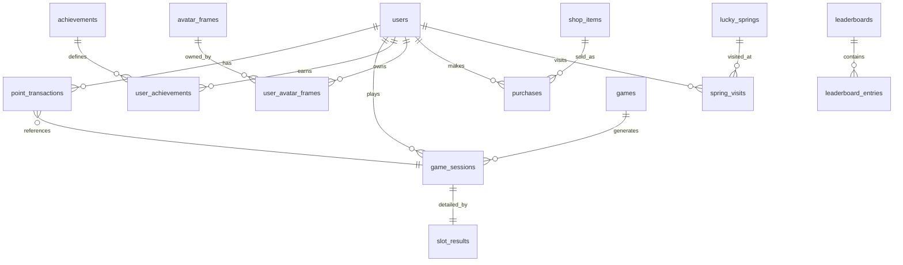

# 🗄️ Points Forest データベース構造ドキュメント

## 📋 概要

Points Forestは、PostgreSQL（Supabase）をベースとしたゲーミフィケーションプラットフォームです。本ドキュメントでは、プロジェクトで定義されているすべてのテーブル、インデックス、関数、およびその関係性について詳細に説明します。

---

## 🏗️ アーキテクチャ概要

- **データベース**: PostgreSQL 15+ (Supabase)
- **認証**: Supabase Auth (`auth.users`テーブル)
- **セキュリティ**: Row Level Security (RLS)
- **拡張機能**: `uuid-ossp` (UUID生成)

---

## 📊 テーブル一覧

### 🔥 **コアシステム**

#### 1. `users` - ユーザー情報
Supabaseの`auth.users`を拡張したユーザープロフィール管理テーブル

```sql
CREATE TABLE users (
  id UUID PRIMARY KEY REFERENCES auth.users(id) ON DELETE CASCADE,
  email TEXT UNIQUE NOT NULL,
  username TEXT UNIQUE NOT NULL,
  display_name TEXT,
  
  -- ゲーム進行
  points INTEGER DEFAULT 0 CHECK (points >= 0),
  level INTEGER DEFAULT 1 CHECK (level >= 1),
  experience INTEGER DEFAULT 0 CHECK (experience >= 0),
  
  -- エンゲージメント追跡
  login_streak INTEGER DEFAULT 0,
  last_login_at TIMESTAMPTZ,
  last_daily_bonus_at TIMESTAMPTZ,
  
  -- プロフィール設定
  avatar_url TEXT,
  avatar_config JSONB DEFAULT '{}',
  profile_theme TEXT DEFAULT 'default',
  avatar_frame_id UUID REFERENCES avatar_frames(id),
  avatar_accessories JSONB DEFAULT '[]',
  
  -- アカウント状態
  is_premium BOOLEAN DEFAULT FALSE,
  premium_expires_at TIMESTAMPTZ,
  is_banned BOOLEAN DEFAULT FALSE,
  ban_reason TEXT,
  
  -- メタデータ
  signup_ip INET,
  last_seen_at TIMESTAMPTZ DEFAULT NOW(),
  created_at TIMESTAMPTZ DEFAULT NOW(),
  updated_at TIMESTAMPTZ DEFAULT NOW()
);
```

**主要インデックス:**
- `idx_users_points` - ポイント降順
- `idx_users_level` - レベル降順  
- `idx_users_login_streak` - ログインストリーク降順
- `idx_users_premium` - プレミアム状態

#### 2. `point_transactions` - ポイント取引履歴
すべてのポイント関連取引を記録する完全な監査ログ

```sql
CREATE TABLE point_transactions (
  id UUID PRIMARY KEY DEFAULT uuid_generate_v4(),
  user_id UUID REFERENCES users(id) ON DELETE CASCADE,
  
  -- 取引詳細
  amount INTEGER NOT NULL, -- 負数も可（支出時）
  balance_after INTEGER NOT NULL CHECK (balance_after >= 0),
  type TEXT NOT NULL CHECK (type IN ('earn', 'spend', 'bonus', 'refund', 'admin')),
  source TEXT NOT NULL, -- 'game', 'achievement', 'daily_bonus', 'purchase', etc.
  
  -- コンテキスト
  description TEXT,
  metadata JSONB DEFAULT '{}',
  reference_id UUID, -- game_sessions, purchases等への参照
  
  -- 管理者追跡
  admin_id UUID REFERENCES users(id),
  admin_note TEXT,
  
  created_at TIMESTAMPTZ DEFAULT NOW()
);
```

**主要インデックス:**
- `idx_point_transactions_user` - ユーザー別、作成日時降順
- `idx_point_transactions_type` - 取引種別別
- `idx_point_transactions_source` - ソース別
- `idx_point_transactions_reference` - 参照ID別

#### 3. `games` - ゲーム設定
利用可能なミニゲームの設定と構成

```sql
CREATE TABLE games (
  id UUID PRIMARY KEY DEFAULT uuid_generate_v4(),
  name TEXT NOT NULL,
  slug TEXT UNIQUE NOT NULL, -- URL用識別子
  type TEXT NOT NULL CHECK (type IN ('number_guess', 'roulette', 'memory', 'trivia')),
  
  -- ゲーム設定
  config JSONB NOT NULL DEFAULT '{}',
  daily_limit INTEGER DEFAULT 10 CHECK (daily_limit > 0),
  min_points INTEGER DEFAULT 1,
  max_points INTEGER DEFAULT 1000,
  
  -- ゲーム状態
  is_active BOOLEAN DEFAULT TRUE,
  is_beta BOOLEAN DEFAULT FALSE,
  requires_premium BOOLEAN DEFAULT FALSE,
  
  -- メタデータ
  description TEXT,
  instructions TEXT,
  icon_url TEXT,
  thumbnail_url TEXT,
  
  created_at TIMESTAMPTZ DEFAULT NOW(),
  updated_at TIMESTAMPTZ DEFAULT NOW()
);
```

#### 4. `game_sessions` - ゲームセッション記録
個別のゲームプレイ記録とスコア管理

```sql
CREATE TABLE game_sessions (
  id UUID PRIMARY KEY DEFAULT uuid_generate_v4(),
  user_id UUID REFERENCES users(id) ON DELETE CASCADE,
  game_id UUID REFERENCES games(id) ON DELETE CASCADE,
  
  -- ゲーム結果
  score INTEGER,
  points_earned INTEGER DEFAULT 0,
  duration_seconds INTEGER,
  
  -- ゲーム状態
  game_data JSONB DEFAULT '{}', -- ゲーム固有データ
  metadata JSONB DEFAULT '{}',  -- 追加コンテキスト
  
  -- セッション追跡
  session_id TEXT, -- ブラウザセッションID
  ip_address INET,
  user_agent TEXT,
  
  created_at TIMESTAMPTZ DEFAULT NOW()
);
```

**主要インデックス:**
- `idx_game_sessions_user` - ユーザー別、作成日時降順
- `idx_game_sessions_game` - ゲーム別、作成日時降順
- `idx_game_sessions_daily` - デイリー制限チェック用
- `idx_game_sessions_score` - ゲーム別スコアランキング用

---

### 🏆 **アチーブメントシステム**

#### 5. `achievements` - アチーブメント定義
達成可能な実績の設定と条件

```sql
CREATE TABLE achievements (
  id UUID PRIMARY KEY DEFAULT uuid_generate_v4(),
  name TEXT NOT NULL,
  slug TEXT UNIQUE NOT NULL,
  description TEXT,
  
  -- 分類
  category TEXT NOT NULL CHECK (category IN ('login', 'games', 'points', 'social', 'special')),
  rarity TEXT NOT NULL CHECK (rarity IN ('common', 'rare', 'epic', 'legendary')),
  
  -- 報酬
  point_reward INTEGER DEFAULT 0,
  badge_image_url TEXT,
  
  -- アチーブメントロジック
  conditions JSONB NOT NULL, -- 達成条件
  is_secret BOOLEAN DEFAULT FALSE,
  is_repeatable BOOLEAN DEFAULT FALSE,
  
  -- 状態
  is_active BOOLEAN DEFAULT TRUE,
  sort_order INTEGER DEFAULT 0,
  
  created_at TIMESTAMPTZ DEFAULT NOW(),
  updated_at TIMESTAMPTZ DEFAULT NOW()
);
```

#### 6. `user_achievements` - ユーザーアチーブメント進行
ユーザーのアチーブメント達成状況

```sql
CREATE TABLE user_achievements (
  id UUID PRIMARY KEY DEFAULT uuid_generate_v4(),
  user_id UUID REFERENCES users(id) ON DELETE CASCADE,
  achievement_id UUID REFERENCES achievements(id) ON DELETE CASCADE,
  
  -- 進行追跡
  progress JSONB DEFAULT '{}',
  current_value INTEGER DEFAULT 0,
  target_value INTEGER,
  
  -- 完了
  completed_at TIMESTAMPTZ,
  notified_at TIMESTAMPTZ,
  
  created_at TIMESTAMPTZ DEFAULT NOW(),
  updated_at TIMESTAMPTZ DEFAULT NOW(),
  
  UNIQUE(user_id, achievement_id)
);
```

**主要インデックス:**
- `idx_user_achievements_user` - ユーザー別
- `idx_user_achievements_completed` - 完了済みアチーブメント

---

### 📈 **ランキングシステム**

#### 7. `leaderboards` - ランキング設定
各種ランキングの設定

```sql
CREATE TABLE leaderboards (
  id UUID PRIMARY KEY DEFAULT uuid_generate_v4(),
  name TEXT NOT NULL,
  type TEXT NOT NULL CHECK (type IN ('points', 'level', 'game_score', 'streak')),
  
  -- ランキング設定
  game_id UUID REFERENCES games(id), -- ゲーム固有ランキング用
  period TEXT DEFAULT 'all_time' CHECK (period IN ('all_time', 'monthly', 'weekly', 'daily')),
  
  -- 設定
  max_entries INTEGER DEFAULT 100,
  is_active BOOLEAN DEFAULT TRUE,
  
  created_at TIMESTAMPTZ DEFAULT NOW()
);
```

#### 8. `leaderboard_entries` - ランキングエントリ
パフォーマンス最適化のための物理化されたランキングデータ

```sql
CREATE TABLE leaderboard_entries (
  id UUID PRIMARY KEY DEFAULT uuid_generate_v4(),
  leaderboard_id UUID REFERENCES leaderboards(id) ON DELETE CASCADE,
  user_id UUID REFERENCES users(id) ON DELETE CASCADE,
  
  -- ランキングデータ
  rank INTEGER NOT NULL,
  value INTEGER NOT NULL, -- ポイント、スコア、ストリーク等
  
  -- メタデータ
  metadata JSONB DEFAULT '{}',
  
  -- 期間
  period_start TIMESTAMPTZ,
  period_end TIMESTAMPTZ,
  
  updated_at TIMESTAMPTZ DEFAULT NOW(),
  
  UNIQUE(leaderboard_id, user_id, period_start)
);
```

---

### 🎨 **アバターシステム**

#### 9. `avatar_frames` - アバターフレーム定義
購入可能なアバターフレームの設定

```sql
CREATE TABLE avatar_frames (
  id UUID PRIMARY KEY DEFAULT uuid_generate_v4(),
  name TEXT NOT NULL,
  type TEXT NOT NULL CHECK (type IN ('bronze', 'silver', 'gold', 'rainbow')),
  price INTEGER NOT NULL CHECK (price >= 0),
  rarity TEXT NOT NULL CHECK (rarity IN ('common', 'rare', 'epic', 'legendary')),
  css_class TEXT NOT NULL,
  unlock_requirement TEXT,
  is_active BOOLEAN DEFAULT TRUE,
  sort_order INTEGER DEFAULT 0,
  created_at TIMESTAMPTZ DEFAULT NOW(),
  updated_at TIMESTAMPTZ DEFAULT NOW()
);
```

#### 10. `user_avatar_frames` - ユーザーフレーム所有
ユーザーが所有するアバターフレーム

```sql
CREATE TABLE user_avatar_frames (
  id UUID PRIMARY KEY DEFAULT uuid_generate_v4(),
  user_id UUID REFERENCES users(id) ON DELETE CASCADE,
  frame_id UUID REFERENCES avatar_frames(id) ON DELETE CASCADE,
  is_equipped BOOLEAN DEFAULT FALSE,
  purchased_at TIMESTAMPTZ DEFAULT NOW(),
  UNIQUE(user_id, frame_id)
);
```

#### 11. `avatar_accessories` - アバターアクセサリ定義
アバター装飾アイテムの設定

```sql
CREATE TABLE avatar_accessories (
  id UUID PRIMARY KEY DEFAULT uuid_generate_v4(),
  name TEXT NOT NULL,
  category TEXT NOT NULL CHECK (category IN ('hat', 'glasses', 'decoration', 'badge')),
  price INTEGER NOT NULL CHECK (price >= 0),
  image_url TEXT,
  position_x INTEGER DEFAULT 0,
  position_y INTEGER DEFAULT 0,
  rarity TEXT NOT NULL CHECK (rarity IN ('common', 'rare', 'epic', 'legendary')),
  is_active BOOLEAN DEFAULT TRUE,
  sort_order INTEGER DEFAULT 0,
  created_at TIMESTAMPTZ DEFAULT NOW(),
  updated_at TIMESTAMPTZ DEFAULT NOW()
);
```

#### 12. `user_avatar_accessories` - ユーザーアクセサリ所有
ユーザーが所有するアバターアクセサリ

```sql
CREATE TABLE user_avatar_accessories (
  id UUID PRIMARY KEY DEFAULT uuid_generate_v4(),
  user_id UUID REFERENCES users(id) ON DELETE CASCADE,
  accessory_id UUID REFERENCES avatar_accessories(id) ON DELETE CASCADE,
  is_equipped BOOLEAN DEFAULT FALSE,
  purchased_at TIMESTAMPTZ DEFAULT NOW(),
  UNIQUE(user_id, accessory_id)
);
```

---

### 🛒 **ショップシステム**

#### 13. `shop_items` - ショップアイテム
景品交換所で購入可能なアイテム

```sql
CREATE TABLE shop_items (
  id UUID PRIMARY KEY DEFAULT uuid_generate_v4(),
  name TEXT NOT NULL,
  description TEXT,
  category TEXT NOT NULL CHECK (category IN ('virtual', 'real_world', 'premium', 'limited')),
  subcategory TEXT,
  
  -- 価格・在庫
  price INTEGER NOT NULL CHECK (price >= 0),
  original_price INTEGER CHECK (original_price >= 0),
  stock INTEGER CHECK (stock >= 0), -- NULL = 無制限
  
  -- 要件
  level_requirement INTEGER CHECK (level_requirement >= 1),
  premium_only BOOLEAN DEFAULT FALSE,
  time_restricted_start TIMESTAMPTZ,
  time_restricted_end TIMESTAMPTZ,
  
  -- メタデータ
  image_url TEXT,
  rarity TEXT CHECK (rarity IN ('common', 'rare', 'epic', 'legendary')),
  tags JSONB DEFAULT '[]',
  is_popular BOOLEAN DEFAULT FALSE,
  is_featured BOOLEAN DEFAULT FALSE,
  is_new BOOLEAN DEFAULT FALSE,
  is_active BOOLEAN DEFAULT TRUE,
  
  sort_order INTEGER DEFAULT 0,
  created_at TIMESTAMPTZ DEFAULT NOW(),
  updated_at TIMESTAMPTZ DEFAULT NOW()
);
```

#### 14. `purchases` - 購入履歴
ユーザーの購入記録

```sql
CREATE TABLE purchases (
  id UUID PRIMARY KEY DEFAULT uuid_generate_v4(),
  user_id UUID REFERENCES users(id) ON DELETE CASCADE,
  item_id UUID REFERENCES shop_items(id) ON DELETE SET NULL,
  
  -- 購入詳細
  item_name TEXT NOT NULL,
  quantity INTEGER DEFAULT 1 CHECK (quantity > 0),
  unit_price INTEGER NOT NULL CHECK (unit_price >= 0),
  total_price INTEGER NOT NULL CHECK (total_price >= 0),
  
  -- 状態
  status TEXT NOT NULL DEFAULT 'completed' CHECK (status IN ('pending', 'completed', 'failed', 'refunded')),
  
  -- 配送情報（リアルアイテム用）
  shipping_info JSONB,
  tracking_number TEXT,
  delivered_at TIMESTAMPTZ,
  
  -- 参照
  transaction_id UUID REFERENCES point_transactions(id) ON DELETE SET NULL,
  
  created_at TIMESTAMPTZ DEFAULT NOW(),
  updated_at TIMESTAMPTZ DEFAULT NOW()
);
```

---

### 🎰 **スロットマシンシステム**

#### 15. `slot_results` - スロット結果
スロットマシンの詳細な結果記録

```sql
CREATE TABLE slot_results (
  id UUID PRIMARY KEY DEFAULT uuid_generate_v4(),
  game_session_id UUID REFERENCES game_sessions(id) ON DELETE CASCADE,
  user_id UUID REFERENCES users(id) ON DELETE CASCADE,
  
  -- スロット結果
  reel_1 TEXT NOT NULL,
  reel_2 TEXT NOT NULL,
  reel_3 TEXT NOT NULL,
  combination_type TEXT,
  multiplier DECIMAL(5,2) DEFAULT 1.0,
  base_points INTEGER NOT NULL CHECK (base_points >= 0),
  bonus_points INTEGER DEFAULT 0 CHECK (bonus_points >= 0),
  
  created_at TIMESTAMPTZ DEFAULT NOW()
);
```

---

### 🌊 **幸運の泉システム**

#### 16. `lucky_springs` - 泉設定
幸運の泉の設定と報酬体系

```sql
CREATE TABLE lucky_springs (
  id UUID PRIMARY KEY DEFAULT uuid_generate_v4(),
  name TEXT NOT NULL,
  slug TEXT UNIQUE NOT NULL,
  description TEXT,
  theme TEXT NOT NULL DEFAULT 'water' CHECK (theme IN ('water', 'forest', 'mystic', 'rainbow')),
  
  -- アクセス要件
  level_requirement INTEGER DEFAULT 1 CHECK (level_requirement >= 1),
  achievement_requirement UUID REFERENCES achievements(id),
  premium_only BOOLEAN DEFAULT FALSE,
  
  -- 報酬設定
  reward_tiers JSONB NOT NULL DEFAULT '[
    {"min_points": 10, "max_points": 50, "probability": 0.50, "tier": "common"},
    {"min_points": 100, "max_points": 200, "probability": 0.25, "tier": "rare"},
    {"min_points": 500, "max_points": 1000, "probability": 0.15, "tier": "epic"},
    {"min_points": 2000, "max_points": 5000, "probability": 0.09, "tier": "legendary"},
    {"min_points": 10000, "max_points": 10000, "probability": 0.01, "tier": "mythical"}
  ]',
  
  -- 制限・クールダウン
  daily_visits INTEGER DEFAULT 1 CHECK (daily_visits > 0),
  cooldown_hours INTEGER DEFAULT 24 CHECK (cooldown_hours > 0),
  
  -- 泉状態
  is_active BOOLEAN DEFAULT TRUE,
  is_seasonal BOOLEAN DEFAULT FALSE,
  season_start TIMESTAMPTZ,
  season_end TIMESTAMPTZ,
  
  -- ビジュアル設定
  animation_config JSONB DEFAULT '{"bubbles": true, "sparkles": true, "glow": true}',
  color_scheme JSONB DEFAULT '{"primary": "#10b981", "secondary": "#059669", "accent": "#34d399"}',
  
  sort_order INTEGER DEFAULT 0,
  created_at TIMESTAMPTZ DEFAULT NOW(),
  updated_at TIMESTAMPTZ DEFAULT NOW()
);
```

#### 17. `spring_visits` - 泉訪問記録
ユーザーの泉訪問とその結果

```sql
CREATE TABLE spring_visits (
  id UUID PRIMARY KEY DEFAULT uuid_generate_v4(),
  user_id UUID REFERENCES users(id) ON DELETE CASCADE,
  spring_id UUID REFERENCES lucky_springs(id) ON DELETE CASCADE,
  
  -- 訪問詳細
  points_earned INTEGER NOT NULL CHECK (points_earned >= 0),
  reward_tier TEXT NOT NULL,
  
  -- 再現性のための乱数シード
  random_seed DECIMAL(10,8) NOT NULL,
  
  -- 訪問メタデータ
  visit_date DATE NOT NULL DEFAULT CURRENT_DATE,
  ip_address INET,
  user_agent TEXT,
  
  created_at TIMESTAMPTZ DEFAULT NOW(),
  
  -- 1日1回制限
  UNIQUE(user_id, spring_id, visit_date)
);
```

#### 18. `spring_statistics` - 泉統計
泉の利用統計（集計データ）

```sql
CREATE TABLE spring_statistics (
  id UUID PRIMARY KEY DEFAULT uuid_generate_v4(),
  spring_id UUID REFERENCES lucky_springs(id) ON DELETE CASCADE,
  
  -- 日次統計
  stat_date DATE NOT NULL DEFAULT CURRENT_DATE,
  total_visits INTEGER DEFAULT 0,
  total_points_awarded INTEGER DEFAULT 0,
  unique_visitors INTEGER DEFAULT 0,
  
  -- ティア分布
  common_rewards INTEGER DEFAULT 0,
  rare_rewards INTEGER DEFAULT 0,
  epic_rewards INTEGER DEFAULT 0,
  legendary_rewards INTEGER DEFAULT 0,
  mythical_rewards INTEGER DEFAULT 0,
  
  updated_at TIMESTAMPTZ DEFAULT NOW(),
  
  UNIQUE(spring_id, stat_date)
);
```

---

## 🔧 **データベース関数**

### 1. `handle_new_user()` - 新規ユーザートリガー
Supabase Authで新規ユーザー作成時に自動実行

```sql
CREATE OR REPLACE FUNCTION handle_new_user()
RETURNS TRIGGER
LANGUAGE plpgsql
SECURITY DEFINER
AS $$
BEGIN
  INSERT INTO public.users (id, email, username, display_name, avatar_url)
  VALUES (
    NEW.id,
    NEW.email,
    COALESCE(NEW.raw_user_meta_data->>'username', SPLIT_PART(NEW.email, '@', 1)),
    COALESCE(NEW.raw_user_meta_data->>'display_name', SPLIT_PART(NEW.email, '@', 1)),
    NEW.raw_user_meta_data->>'avatar_url'
  );
  RETURN NEW;
END;
$$;
```

### 2. `handle_game_session()` - ゲームセッション処理
ゲーム完了時のポイント付与と制限チェック

```sql
CREATE OR REPLACE FUNCTION handle_game_session(
  p_user_id UUID,
  p_game_id UUID,
  p_score INTEGER,
  p_points_earned INTEGER,
  p_metadata JSONB DEFAULT '{}'
)
RETURNS JSONB
LANGUAGE plpgsql
SECURITY DEFINER
```

### 3. `process_daily_bonus()` - デイリーボーナス処理
デイリーログインボーナスの付与とストリーク管理

```sql
CREATE OR REPLACE FUNCTION process_daily_bonus(p_user_id UUID)
RETURNS JSONB
LANGUAGE plpgsql
SECURITY DEFINER
```

### 4. `check_achievements()` - アチーブメント確認
ユーザーのアチーブメント達成状況をチェック

```sql
CREATE OR REPLACE FUNCTION check_achievements(p_user_id UUID)
RETURNS INTEGER
LANGUAGE plpgsql
SECURITY DEFINER
```

### 5. `visit_lucky_spring()` - 泉訪問処理
幸運の泉での抽選とポイント付与

```sql
CREATE OR REPLACE FUNCTION visit_lucky_spring(
  p_user_id UUID,
  p_spring_slug TEXT
)
RETURNS JSONB
LANGUAGE plpgsql
SECURITY DEFINER
```

### 6. `get_user_spring_status()` - ユーザー泉状態取得
ユーザーがアクセス可能な泉の状態を取得

```sql
CREATE OR REPLACE FUNCTION get_user_spring_status(p_user_id UUID)
RETURNS JSONB
LANGUAGE plpgsql
SECURITY DEFINER
```

### 7. `equip_avatar_frame()` - アバターフレーム装備
アバターフレームの装備・変更

```sql
CREATE OR REPLACE FUNCTION equip_avatar_frame(
  p_user_id UUID,
  p_frame_id UUID
)
RETURNS JSONB
LANGUAGE plpgsql
SECURITY DEFINER
```

### 8. `purchase_avatar_frame()` - アバターフレーム購入
アバターフレームの購入処理

```sql
CREATE OR REPLACE FUNCTION purchase_avatar_frame(
  p_user_id UUID,
  p_frame_id UUID
)
RETURNS JSONB
LANGUAGE plpgsql
SECURITY DEFINER
```

---

## 🔒 **セキュリティ設定**

### Row Level Security (RLS)
すべてのテーブルでRLSが有効化され、ユーザーは自身のデータのみアクセス可能

```sql
-- ユーザーは自身の記録のみ閲覧可能
CREATE POLICY "Users can view own profile" ON users
  FOR SELECT USING (auth.uid() = id);

CREATE POLICY "Users can update own profile" ON users
  FOR UPDATE USING (auth.uid() = id);

CREATE POLICY "Users can view own transactions" ON point_transactions
  FOR SELECT USING (auth.uid() = user_id);

CREATE POLICY "Users can view own game sessions" ON game_sessions
  FOR SELECT USING (auth.uid() = user_id);
```

### セキュリティ機能
- **関数セキュリティ**: `SECURITY DEFINER`で権限昇格
- **データ整合性**: CHECK制約によるデータ検証
- **監査ログ**: 完全なポイント取引履歴
- **不正防止**: IPアドレス・ユーザーエージェント記録

---

## 📈 **パフォーマンス最適化**

### インデックス戦略
```sql
-- 頻繁なクエリ用インデックス
CREATE INDEX idx_users_points ON users(points DESC);
CREATE INDEX idx_game_sessions_daily ON game_sessions(user_id, game_id, created_at);
CREATE INDEX idx_point_transactions_user ON point_transactions(user_id, created_at DESC);

-- 複合インデックス
CREATE INDEX idx_user_achievements_completed ON user_achievements(completed_at) 
WHERE completed_at IS NOT NULL;

-- 部分インデックス
CREATE INDEX idx_shop_items_featured ON shop_items(is_featured, is_active) 
WHERE is_featured = TRUE AND is_active = TRUE;
```

### データ分割戦略
- **時系列データ**: `created_at`による範囲クエリ最適化
- **ユーザー分離**: `user_id`による効率的な分離
- **期間別ランキング**: 物理化されたランキングテーブル

---

## 🔄 **データ関係図**



---

## 📝 **変更履歴・バージョン管理**

### v1.0 - 基本システム
- ユーザー管理
- ポイントシステム
- ゲーム機能
- アチーブメント

### v1.1 - アバターシステム追加
- アバターフレーム
- アクセサリシステム

### v1.2 - ショップ・景品交換所
- ショップアイテム
- 購入履歴

### v1.3 - 幸運の泉システム
- 泉設定
- 訪問記録
- 統計機能

---

## 🚀 **拡張予定**

### フェーズ2予定機能
- クエストシステム (`quest_templates`, `user_quests`)
- ガチャシステム (`gacha_machines`, `gacha_items`, `gacha_pulls`)
- ソーシャル機能 (フレンド、チーム)
- 通知システム

### 最適化予定
- パーティショニング（時系列データ）
- マテリアライズドビュー（統計データ）
- 読み取り専用レプリカ（ランキング）

---

このドキュメントは、Points Forestプロジェクトのデータベース構造の完全な仕様を提供します。新機能追加やメンテナンス時の参考として活用してください。 